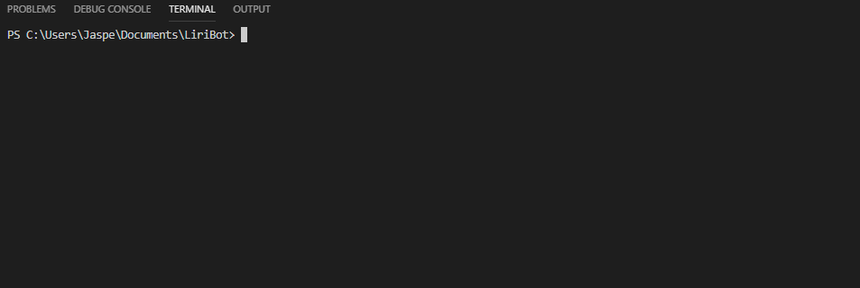
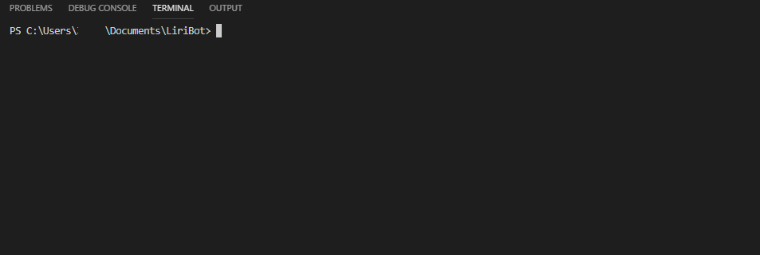

# LiriBot
### For movie, song and artist searching

Liribot allows you to search for movies songs or artists using a node cli.
The application is organized into four functions:
  - ```concert-this```
  - ```spotify-this-song```
  - ```movie-this```
  - ```do-what-it-says```

### concert-this
concert-this is used to find upcoming concerts for the specified artist/band. You can execute the command by running:

```node liri.js concert-this [Artist/Band]```



### spotify-this-song
spotify-this-song is used to search for songs, and get links to previews of them. It uses the spotify API to do this. You can execute the command by runing:

```node liri.js spotify-this-song [Song Name]```


### movie-this
movie-this is used to get information about a given movie. You can execute the command by running:

```node liri.js movie-this [Movie Name]```



### do-what-it-says
do-what-it-says is used to execute a random command, as layed out in random.txt. You can do this by running:

```node liri.js do-what-it-says```
